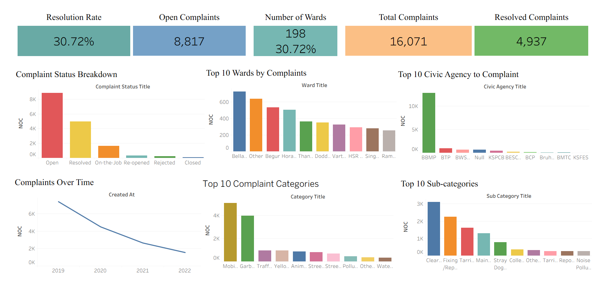

# Municipal Complaints Dashboard

## Overview
This project presents an interactive Tableau dashboard built to analyze municipal complaints data for Bengaluru. The dashboard focuses on complaint volume, complaint status, ward-level distribution, civic agency-wise complaints, and complaint category trends.

The dataset used in this project was already sorted before analysis. The primary focus of this project was dashboard creation, data visualization, and extracting insights using Tableau.

## Tool Used
- Tableau

## Project Objective
The goal of this dashboard is to provide a clear overview of municipal complaints and help identify patterns in complaint resolution, complaint distribution across wards, civic agencies receiving the most complaints, and the most common complaint categories.

## Dashboard Highlights
The dashboard includes the following key views:

### KPI Summary Cards
- Resolution Rate
- Open Complaints
- Number of Wards
- Total Complaints
- Resolved Complaints

### Visual Analysis Sections
- Complaint Status Breakdown
- Top 10 Wards by Complaints
- Top 10 Civic Agencies by Complaints
- Complaints Over Time
- Top 10 Complaint Categories
- Top 10 Complaint Sub-categories

## Key Insights Covered
- Distribution of complaints by status such as Open, Resolved, On-the-Job, Re-opened, Rejected, and Closed
- Wards with the highest complaint volumes
- Civic agencies receiving the highest number of complaints
- Complaint trends over time
- Most frequent complaint categories and sub-categories

## Dataset Note
The dataset used for this project was already sorted before dashboarding. This project mainly focuses on analysis and dashboard development in Tableau rather than data cleaning or preprocessing.

## Repository Structure
- `Dashboard/` — Tableau workbook file
- `Data/` — dataset used for the dashboard
- `Screenshot/` — dashboard preview image(s)

## Dashboard Preview

## Project Scope
This project was created as a data visualization and dashboarding exercise to explore municipal complaints data and present insights in a structured and interactive format using Tableau.